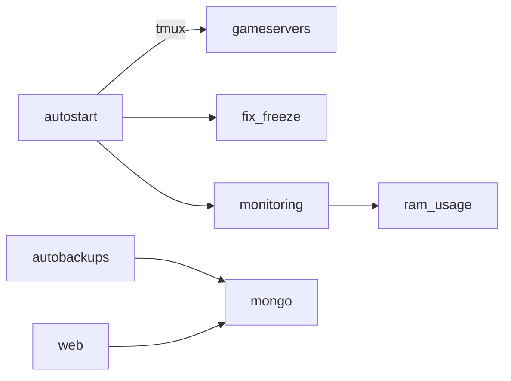

# scpsl-very-bad-scripts-2020 💀🛠️

   


> **scpsl‑very‑bad‑scripts‑2020** — коллекция крайне неаккуратных утилит для автоматизации хостинга *SCP: Secret Laboratory*. Код грубый и далёк от production‑ready, но, возможно, кому‑то пригодятся идеи или сниппеты.

---

## 📂 Состав репозитория

| Путь / скрипт              | Стек                        | Назначение                                                                                                           |
| -------------------------- | --------------------------- | -------------------------------------------------------------------------------------------------------------------- |
| **`autostart.js`**         | Node.js + tmux              | Оркестрация: поднимает линейку tmux‑сеансов, запускает QurreBot, игровые серверы и мониторинг |
| **`autobackups/`**         | Node.js (`mongodump`)       | Ежедневные резервные копии MongoDB с упаковкой в ZIP                                            |
| **`fix_freeze/`**          | Node.js + `net`             | Слушает локальный сокет; перезапускает зависшие SCP\:SL‑процессы по сигналу                 |
| **`ram_usage/`**           | Express + systeminformation | Мини‑HTTP‑эндпоинт `GET /` → % использования RAM                                                |
| **`db_startup.js`**        | Node.js + tmux              | Запуск MongoDB с кастомным `mongod.conf`                                                      |
| **`mod_startup.js`**       | Node.js + tmux              | Инициализация системных утилит (system‑stats, autobackups)                                     |
| **`qurre_startup.js`**     | Node.js + tmux              | Альтернативный запуск MongoDB для Qurre‑окружения                                             |
| **`sl-startup/*.js`**      | Node.js + tmux              | Скрипты автоперезапуска отдельных игровых инстансов (MRP, NR, Verify)                         |


---

## ⚡️ Быстрый тест (не для продакшна)

```bash
# ⚠️ ВСЁ идёт от root и без обработки ошибок.
git clone https://github.com/Shiro-nn/scpsl-very-bad-scripts-2020.git
cd scpsl-very-bad-scripts-2020
node autostart.js                # запустит все сервисы в tmux
```

Для резервного копирования:

```bash
cd autobackups
node script.js &                  # ежедневные бэкапы MongoDB
```

---

## 🧩 Мини‑архитектура



---

## 🔥 Известные проблемы

* Жёстко захардкоженные пути (`/root/...`).
* URI к БД лежат в открытом виде.
* Отсутствие обработки ошибок: падение процесса = падение сервиса.
* Скрипты «самоликвидируются» через `pm2 stop`, что осложняет отладку.

---

## ⚖️ Лицензия

**MIT**, но используйте на свой страх и риск.

---

## 📜 Статус

Проект **архивирован**: баг‑фиксы и pull‑request‑ы не принимаются.
